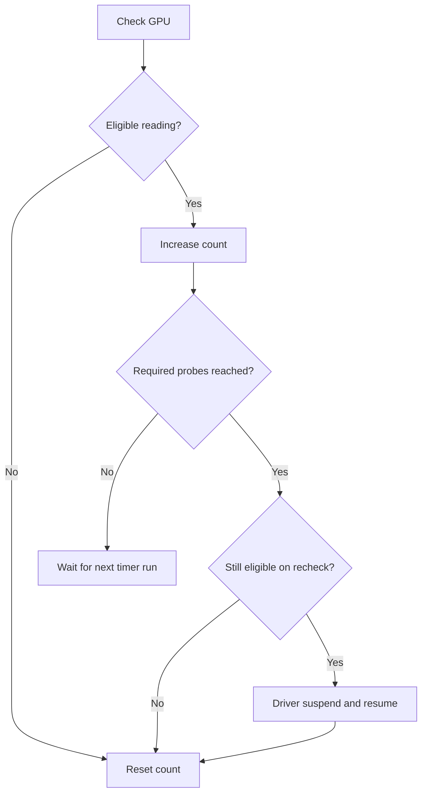

# NVIDIA Idle Power Watchdog

A Linux/systemd workaround for a headless host with one NVIDIA GPU whose power
stays above its normal idle level after returning to P8. The watchdog checks
every two minutes and uses a brief NVIDIA driver suspend/resume pulse if the
high-power condition persists.

> [!CAUTION]
> Use this only when the NVIDIA GPU is not driving a display. The tool runs as
> root and briefly suspends the NVIDIA driver, which can interrupt GPU work or
> display output. It does not suspend the operating system.

The pulse is a community workaround, not an NVIDIA-supported fix for high idle
power or its underlying cause. NVIDIA documents `/proc/driver/nvidia/suspend`
for coordinated system power management.

## When this may help

Elevated P8 idle power has been reported in these situations:

- **After compute workloads:** It has appeared after Ollama, llama.cpp, and
  vLLM use on a headless Proxmox host. In a [similar headless RTX 3090
  report](https://forums.developer.nvidia.com/t/high-idle-power-consumption-in-headless-server-without-monitor-connected/311064/7),
  a suspend/resume pulse lowered idle power even with a model still loaded.
- **After headless boot:** An [RTX 3090 report](https://forums.developer.nvidia.com/t/high-idle-power-consumption-in-headless-server-without-monitor-connected/311064)
  describes elevated P8 power before a display was connected.
- **After a driver change:** An [RTX 3080 Ti report](https://forums.developer.nvidia.com/t/increased-idle-consumption-with-driver-570/321460)
  describes higher idle power after updating to driver 570.

These reports do not establish one cause or show that the pulse helps in every
case. The strongest matching experience is with a headless RTX 3090; other
GPUs, drivers, and setups remain unverified for this project.

Measure normal P8 idle power on your own GPU and setup, then compare readings
after the workload settles. One high reading, P8, or zero reported utilization
alone is not enough. In another [headless GPU report](https://forums.developer.nvidia.com/t/575-3090-idling-at-over-100-watts/339427),
`nvidia-smi` monitoring itself changed the observed power behavior.

## Test the pulse manually

Before enabling the timer, check that `nvidia-smi -L` lists exactly one NVIDIA
GPU. Choose a time when GPU work can be interrupted. Record its P8 power draw
with this command:

```bash
nvidia-smi --query-gpu=pstate,power.draw,utilization.gpu --format=csv,noheader,nounits
```

If the GPU is in the elevated idle state, run these commands on the host:

```bash
printf 'suspend\n' | sudo tee /proc/driver/nvidia/suspend >/dev/null
sleep 1
printf 'resume\n' | sudo tee /proc/driver/nvidia/suspend >/dev/null
```

Take the same power reading again and confirm that the GPU still accepts work.
These direct writes bypass the watchdog's GPU count and activity checks. If the
resume write fails, inspect the driver and GPU state before proceeding. This
test checks whether the pulse helps on your machine; it does not test the
watchdog's automatic detection. If idle power does not improve, leave the timer
disabled.

## How it works

Each timer run checks the GPU. The watchdog follows this path:



An eligible reading means P8, zero reported utilization, power above the
configured threshold, and the mode-specific requirement below. The timer runs
every two minutes.

| Mode | Additional requirement | Use case |
| --- | --- | --- |
| `strict` (default) | No reported compute processes | Conservative automatic operation |
| `loaded-idle` | None | A loaded model may remain resident |

In `loaded-idle`, a request could start between the check and the driver
operation. The strict mode checks compute processes reported by `nvidia-smi`.
The watchdog uses locks to prevent overlapping recovery attempts.

## Requirements

- Linux, systemd, one headless NVIDIA GPU that is not driving a display, a
  working NVIDIA driver, and `nvidia-smi`
- Bash, `flock` (util-linux), `awk`, and `logger`
- A writable `/proc/driver/nvidia/suspend` interface
- A GPU that reaches P8 during normal idle periods

## Install and configure

Choose these settings from your own GPU readings before enabling the timer:

| Setting | How to choose it |
| --- | --- |
| `MODE` | Use `strict` unless a model stays loaded while idle and you accept the risk of interrupting it; then use `loaded-idle`. |
| `POWER_THRESHOLD_W` | Set a positive watt value above normal P8 idle power and below the persistent elevated reading. |
| `REQUIRED_PROBES` | Set an integer from 1 to 2147483647 for how many consecutive checks must match. Checks run every two minutes. |

The [example configuration](config.example) uses `25` W and five probes chosen
for one RTX 3090. These are not universal settings.

The commands below follow five steps. They clone the repository, install the
scripts and units, create a config only if one does not exist, open it for
editing, and ask before enabling the timer. Check the values in the editor
before answering `y`.

```bash
(
  set -e
  # 1. Get the repository.
  git clone https://github.com/RJTPP/nvidia-idle-power-watchdog.git
  cd nvidia-idle-power-watchdog

  # 2. Install the scripts and systemd units. The timer remains disabled.
  sudo ./install.sh

  # 3. Keep an existing configuration; otherwise copy the example.
  if [ ! -e /etc/default/nvidia-idle-power-watchdog ]; then
    sudo install -m 0644 config.example /etc/default/nvidia-idle-power-watchdog
  fi

  # 4. Set the mode, power threshold, and required probe count.
  sudoedit /etc/default/nvidia-idle-power-watchdog

  # 5. Enable only after reviewing the configuration.
  printf 'Enable the watchdog timer now? [y/N] '
  read -r enable_timer
  if [ "${enable_timer:-}" = y ] || [ "${enable_timer:-}" = Y ]; then
    sudo systemctl enable --now nvidia-idle-power-watchdog.timer
  fi
)
```

The watchdog sources the config as a shell file, so keep the installed file
root-controlled. It needs no network access or external service. For commands
that install and remove the files without either helper script, see the
[manual installation guide](docs/manual-install.md).

## Observe and roll back

```bash
systemctl status nvidia-idle-power-watchdog.timer
journalctl -t nvidia-idle-power-watchdog -b
journalctl -u nvidia-idle-power-watchdog.service -b
sudo systemctl disable --now nvidia-idle-power-watchdog.timer
```

To uninstall, enter the cloned repository and run `sudo ./uninstall.sh`. This
disables the timer and waits up to 30 seconds for a running check to finish
before removing the program and units. If the check is still running, it keeps
the files in place; retry after the check finishes. The configuration remains
for a later reinstall.

## Limits and recovery

- The NVIDIA suspend interface acts on the driver, with no documented way to
  select one GPU. The pulse might help on a multi-GPU host, but this project
  has not tested that use. The watchdog refuses automatic recovery when
  `nvidia-smi` reports more than one GPU.
- A transient high-power reading cannot trigger recovery.
- If `nvidia-smi` fails or returns invalid data, recovery does not run.
- The recovery script attempts `resume` on exit if an error follows `suspend`.
  If the driver does not recover, check the service log and GPU state before
  trying again.
- The two-minute interval can be changed with a systemd timer override.

NVIDIA's [power-management documentation](https://download.nvidia.com/XFree86/Linux-x86_64/535.216.01/README/powermanagement.html)
describes the intended suspend interface and its requirements.

### Other approaches to check

- If power is high from boot, check display detection. Users reported a drop
  after connecting a monitor or HDMI emulator; one described a [fake EDID
  setup](https://forums.developer.nvidia.com/t/high-idle-power-consumption-in-headless-server-without-monitor-connected/311064).
- If it began after a driver upgrade, compare driver versions. In a [driver
  570 discussion](https://forums.developer.nvidia.com/t/increased-idle-consumption-with-driver-570/321460),
  one user reported lower idle power after reverting to 565.
- A manual [GPU reset](https://docs.nvidia.com/deploy/nvidia-smi/) is an option
  when you can stop workloads. NVIDIA requires that no applications, including
  monitoring tools, be using the GPU being reset.

These options address different situations; none is required to install the
watchdog.

## Test

`bash tests/test.sh` uses stubbed GPU readings and a temporary fake suspend
interface. It never accesses a real GPU. This watchdog has also been used on a
Proxmox host; behavior may vary with the GPU and driver.
